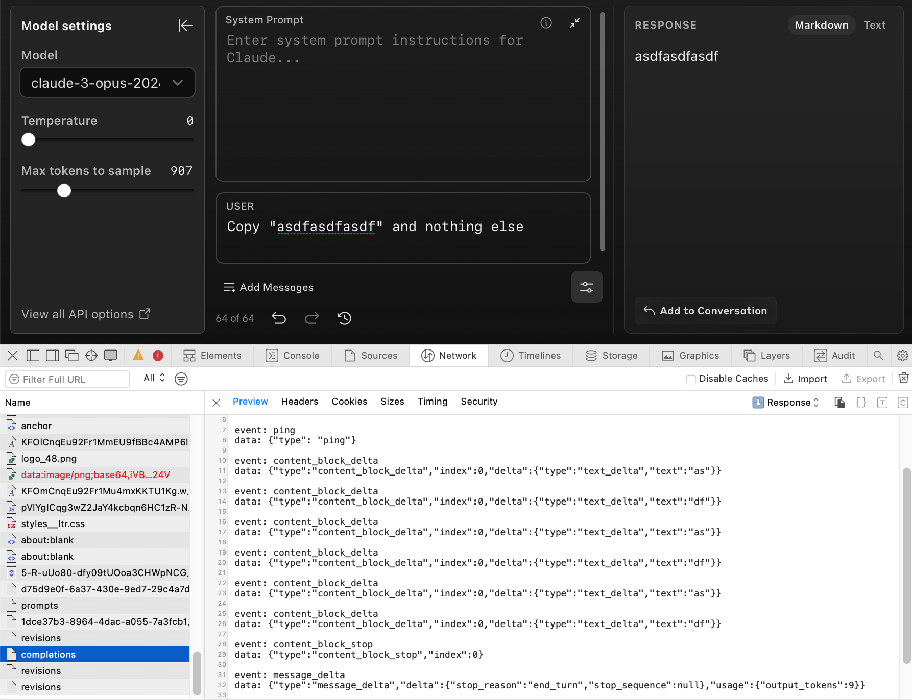

# The Worst (But Only) Claude 3 Tokenizer

_Not an official implementation_. By _Javier Rando and Florian Tramèr_. If your usage of this tool falls within Anthropic's [Responsible Disclosure Policy](https://www.anthropic.com/responsible-disclosure-policy), we encourage you to follow their protocols.

See our [blog post](https://javirando.com/blog/2024/claude-tokenizer/) and [Twitter thread](https://twitter.com/javirandor/status/1767602845111492685).

Anthropic recently released [Claude 3](https://www.anthropic.com/news/claude-3-family), but has not publicly released the tokenizer used for this family of models. But no worries! You can reverse-engineer the tokenizer by analyzing the generation streaming.

> 💡 The idea is simple. Ask Claude to repeat some text and observe how the generation is streamed through the network. It turns out that Anthropic serves one token at a time!

This is probably the **least efficient implementation of a tokenizer** (but it is also the only publicly available one that we know of!). This may be useful for experiments where tokenization plays an important role and spending some tokens is not a problem. It is unclear how faithful this tokenization will be but our experiments suggest this is very likely a close approximation.

### How to use

First, create an Anthropic account and obtain your API key. Export your API key as an environment variable:

```bash
export ANTHROPIC_API_KEY=your_api_key
```

⚠️ Running the following commands will consume tokens from your account. ⚠️

**Single string tokenization**

You can quickly tokenize a single string by using the `--text` argument:

```bash
python anthropic_tokenizer.py --text "Security by obscurity is not a good idea."
```

which outputs
```
Tokens: ['Security', ' by', ' obsc', 'urity', ' is', ' not', ' a', ' good', ' idea', '.']
Number of text tokens: 10
Total tokens usage (as of API): 13
```

The API number of tokens for successful tokenization seems to always be `number of text tokens + 3`. This may include start and end of sentence tokens.

**Batched tokenization**

If you want to tokenize more than one string at a time, you can use the `--file` argument. Specify a JSONL file (e.g. `to_tokenize.jsonl`) containing a `"text"` entry in each line. You can have additional keys that will be preserved after tokenization.

```bash
python src/anthropic_tokenizer.py --file to_tokenize.jsonl
```

This will output a file with name `{FILE_NAME}_tokenized.jsonl.` with 4 additional fields:
* `tokens`: list of tokens in your input text.
* `number_of_tokens`: number of text tokens in your input text.
* `api_total_tokens_usage`: number of tokens as reported by the API. This seems to be always `number_of_tokens + 3`. This may include start and end of sentence tokens.
* `tokenization_correct`: boolean indicating if the tokenized text is equal to the provided text. Use this to verify if tokenization can be trusted for a specific string.

**Keeping track (and share!) your vocabulary**

By default, the above scripts will create (and append lines to) a file called `anthropic_vocab.jsonl`. This file will contain all the tokens you found so far. Since tokens can be repeated across inputs, you can consolidate the file to preserve only unique tokens by running:

```bash
python src/consolidate_vocab.py
```

You can create pull requests (or share via email) your `anthropic_vocab.jsonl` file and will try to keep a consolidated large vocabulary that others can use in this repository.

## Known limitations
* Current prompt fails for **trailing spaces and breaklines**.
  * 🩹 Solution: append some prefix text.
* The generation stream **merges breaklines and tokens into a single event**. For instance, `\n1` will be received in a single stream event, but is very likely tokenized as 2 tokens (according to some experiments limiting the max sampling tokens).
  * 🩹 Solution: Remove breaklines from your text and assume they will be an independent token.  

## Motivating Example

We ran several tests to verify whether the API traffic leaks tokenization. It could be possible that the API served text per words or a different unit (e.g. characters).

We started with a long string that is unlikely to be a single token: `asdfasdfasdf`

1. We then check the tokenization of the OpenAI tokenizer


2. We ask Claude 3 to copy the string **but limiting the maximum number of output tokens to 1**. This outputs "as".


3. We repeat the same but **limiting the maximum number of tokens to 2**. This outputs "asdf".


4. If you inspect the network traffic (or the streaming in Python) you will find that `text_delta` matches tokens.

